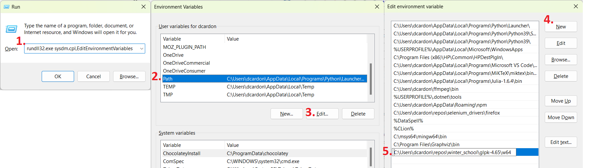

# Aggregated Power System Optimization Models

## System Requirements:
- Python 3 (tested on 3.9 but should work on 3.10 too)
- Libraries: look at the environment.yml configuration file
- A LP solver, even an **open source** one like GLPK (https://www.gnu.org/software/glpk/)

## Installation Instructions

These instructions are meant to be hassle-free and do not constitute the best practices; those who know Python can look at the environment.yml file or the end of this Readme and manually install the requirements. If you don't have a solver installed on your machine, please follow the instructions to install and configure GLPK.

### Installing GLPK on Windows
1. Go to https://sourceforge.net/projects/winglpk/
2. Download the latest version of the GLPK binaries
3. Extract the contents to the folder of your choice
4. Add the w64 folder from the glpk installation to the *Path* system variable

### Installing Python
1. Download the repository as a zip file, and extract its contents to a folder of your choice
2. Download and install the Anaconda distribution (https://www.anaconda.com/)
2. Open an Anaconda command line: Start -> All apps -> Anaconda3 -> Anaconda Powershell
3. Navigate to the folder where environment.yml file is located (using cd)
4. Create the environment: conda env create --name winter_school --file environment.yml

### Running the Tutorial
1. Open Jupyter: Start -> All apps -> Anaconda3 -> Jupyter (winter_school)
2. Navigate to the location where you extracted the repository
3. Select any of ipynb file to open them 

### Checking the Installation
1. Open jupyter and select the 00_Python_Basics.ipynb
2. Press Shift+Enter to run each cell; if the code runs without errors, you're ready for the tutorial session.

### For those familiar with Python: 
For those who know their way around with Python and do not want to make a complete installation of the required libraries which are (however, note that these will also install their own dependencies):
- numpy
- pandas
- openpyxl
- pyyaml
- matplotlib
- seaborn
- scikit-learn
- scikit-learn-extra

This is a work in progress, so feedback is greatly appreciated. Have fun!

**Author**: David Cardona-Vasquez \
**Copyright**: Copyright 2022, Graz University of Technology \
**Status**: Development 